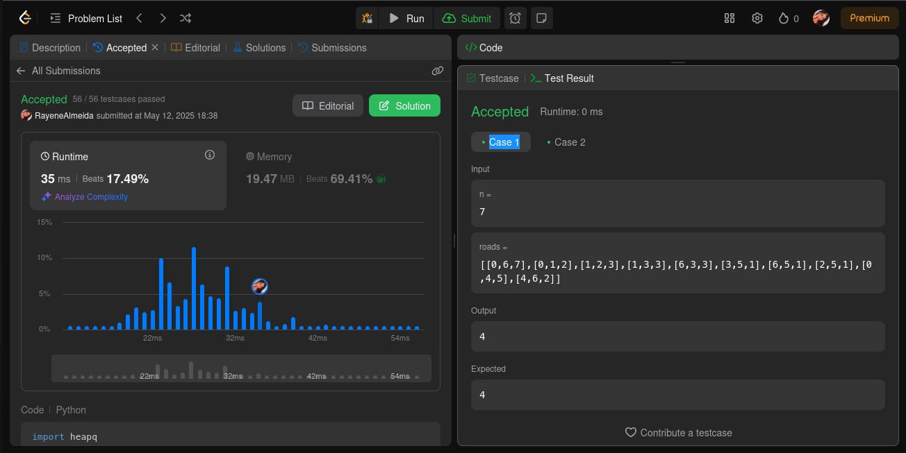
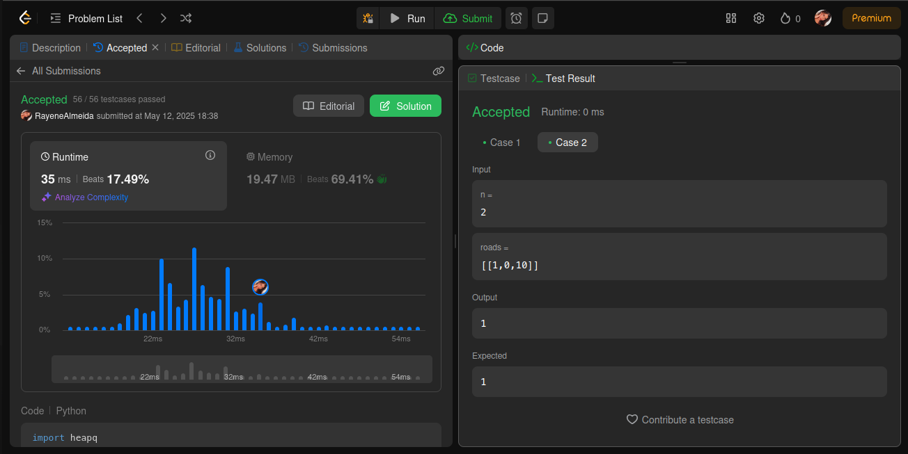
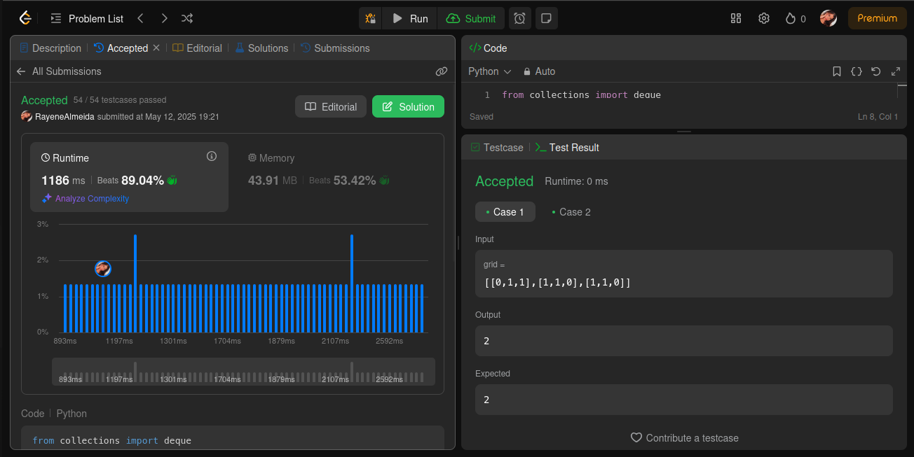
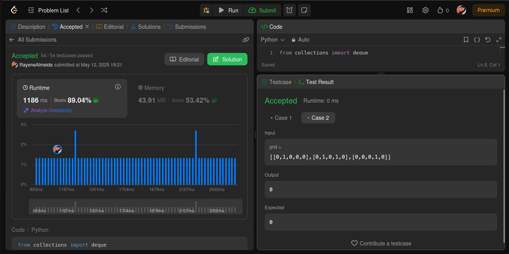

# Questões LeetCode

**Conteúdo da Disciplina**: Grafos 2

## Alunos
|Matrícula | Aluno |
| -- | -- |
| 22/1022720  | Rayene Ferreira Almeida |
| 17/0108341 | Levi de Oliveira Queiroz |


## Sobre 
O objetivo deste repositório é conter as soluções de problemas nível médio e hard de programação do LeetCode. 


## Screenshots
### [1976. Number of Ways to Arrive at Destination](https://leetcode.com/problems/number-of-ways-to-arrive-at-destination/description/)




### [2290. Minimum Obstacle Removal to Reach Corner](https://leetcode.com/problems/minimum-obstacle-removal-to-reach-corner/description/)





### [1489. Find Critical and Pseudo-Critical Edges in Minimum Spanning Tree](https://leetcode.com/problems/find-critical-and-pseudo-critical-edges-in-minimum-spanning-tree/description/)


### [1514. Path with Maximum Probability](https://leetcode.com/problems/path-with-maximum-probability/description/)


## Instalação 
**Linguagem**: Python<br>
1. Navegue até a pasta do problema desejado. Ex: `cd 2290`
2. Rode o algoritmo com o comando:

```
python3 resolucao.py
```

## Uso 
Apenas execute o código

## Vídeo 

[](https://youtu.be/NeRQf54G6_Q)


